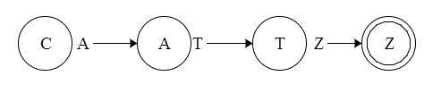

[grumble]() - A Hack of a Regular Expressions Engine
=======
[](https://drone.io/github.com/shrimpboyho/grumble/latest)

```grumble``` is a regular expression engine written in C++.
The following is a representation of the underlying data structure the engine is dependent on. Each node represents a state. Each state has several connections that connect to other nodes. The following shows a machine structure that will accept the string ```"CATZ"```. Although not displayed, each node has 128 connection (for the 128 ASCII characters), many of which are ```NULL```.


##How To Use It
```c++
#include <iostream>
#include <stdlib.h>
#include "grumble.h"

int main (int agrc, char* argv[])
{
    // Create the grumble regular expression object
    GRUMBLE::Grumble croc("CAT.");
    
    // Test a string
    bool result = croc.match("CATZ");
            
    return 0;
}
```

##Constructing an Expression

This project aims to support a subset of the ECMAScript regular expressions syntax. Refer to such guides to construct an expression.

Taken directly from the Python Docs:

> Regular expressions use the backslash character ('\') to indicate special forms or to allow special characters to be used without invoking their special meaning. This collides with C++'s usage of the same character for the same purpose in string literals; for example, to match a literal backslash, one might have to write '\\\\' as the pattern string, because the regular expression must be \\, and each backslash must be expressed as \\ inside a regular C++ string literal.

##How It Works

Internally, ```grumble```, consists of two main phases:

- Interpret a regular expression string and create an identical node structure that represents the finite state automata machine.
- Pass a string through the machine and see if it matches.

```grumble``` currently can support simple regular expressions, such as
```CAT.``` which matches a string starting with ```CAT``` and followed by any one random character.

##Features

There are several features which are not implemented yet. In order to implement more advanced features such as groupings, quantifiers, and more, a better tokenizer is needed for the regular expression itself. This extra lexing and parsing phase is necessary in order to construct more complex finite state machines.
